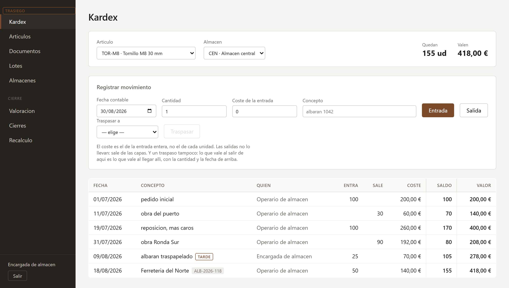
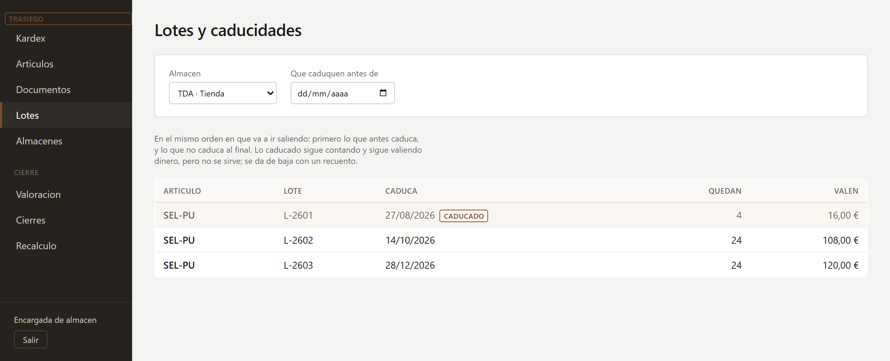
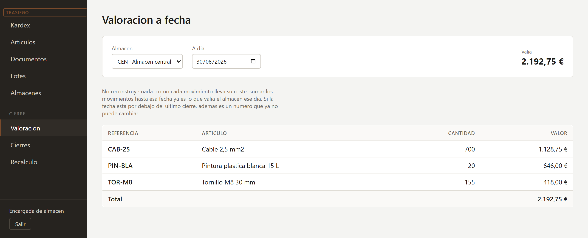
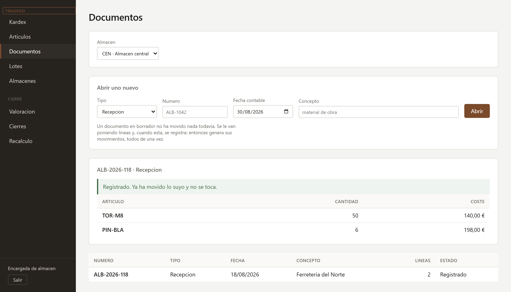

# Trasiego

[](https://github.com/MendietaGarciaAlejandro/Trasiego/actions/workflows/pruebas.yml)

ERP de inventario con valoración. Un trasiego es pasar algo de un recipiente a otro, que es
literalmente lo que hace un movimiento de existencias.

La idea no es abarcar mucho, sino ir hondo en una sola cosa. Un CRUD de almacén lo hace
cualquiera; lo que tiene miga es que el **valor** del almacén cuadre siempre, y que siga
cuadrando cuando alguien mete un movimiento con fecha del mes pasado, devuelve material que
compró a otro precio, o dos personas descuentan del mismo stock a la vez.

De ahí sale la única regla que no se puede romper nunca:

> El valor de un almacén es siempre igual a la suma de sus movimientos valorados.

Todo lo demás del proyecto está para que esa frase siga siendo verdad.

## Cómo se ve

Al arrancar en desarrollo se siembra un almacén que ya ha vivido un par de meses, así que
esto es lo que sale sin teclear nada.



La ficha de un artículo. Los tornillos entraron a 2 € y luego a 2,60: la salida del 31 de
julio se come lo que quedaba de la primera entrada y sigue por la segunda, y por eso 90
unidades cuestan 192 € y no 234. El albarán del 9 de agosto llegó con fecha anterior a
movimientos que ya estaban registrados, y va marcado como **tarde**. Cada línea dice quién la
registró y de qué papel salió.



Lo que hay repartido por lotes, en el orden en que va a ir saliendo: primero lo que antes
caduca. Del primer lote quedaron cuatro botes sin servir y ya han vencido; siguen contando y
siguen valiendo dinero, pero no se sirven.



Lo que valía un almacén un día concreto. No reconstruye nada: como cada movimiento lleva su
coste, esto es sumar movimientos hasta esa fecha.



Un albarán con sus líneas. Mientras es borrador no ha movido nada; al registrarlo genera sus
movimientos de una vez, o no genera ninguno.

## Stack

- .NET 10, capas separadas (Dominio, Aplicación, Infraestructura, Api)
- SQL Server 2022 y EF Core 10
- JWT para identificarse y BCrypt para las contraseñas
- xUnit; los tests de integración corren sobre LocalDB
- ASP.NET Core con controllers, y Scalar para probarla a mano (`/scalar` en desarrollo)
- Las pantallas en Blazor, en una biblioteca aparte, con dos hosts: WPF con `BlazorWebView`
  para el escritorio y WebAssembly para la web

## Cómo levantarlo

Hace falta SQL Server (vale Developer Edition) y LocalDB para los tests. No hace falta Docker.

```bash
dotnet tool restore
dotnet user-secrets set "Jwt:Clave" "una clave larga y aleatoria" --project src/Trasiego.Api
dotnet ef database update --project src/Trasiego.Infraestructura --startup-project src/Trasiego.Api
dotnet run --project src/Trasiego.Api
```

Eso levanta la Api y, en la misma dirección, el cliente web: `http://localhost:5248`. Para el
escritorio, con la Api ya levantada:

```bash
dotnet run --project src/Trasiego.Escritorio
```

En desarrollo se siembran dos usuarios con los que entrar, los dos con la contraseña
`trasiego-demo-2026`: `encargada@trasiego.test` (responsable) y `operario@trasiego.test`.

Y se siembra también un almacén que ya ha vivido un par de meses, que es lo que se ve en las
capturas de arriba: cuatro artículos, tres almacenes, capas a dos precios, un traspaso, una
devolución, un almacén que sirvió sin tener género, tres lotes con caducidades escalonadas, un
albarán y un cierre. Se registra todo por los servicios de siempre y no metiendo filas a mano,
porque sembrar por debajo dejaría las capas y los consumos valiendo lo que yo creo que
valdrían en vez de lo que valen.

La cadena de conexión está en `appsettings.Development.json` y apunta a `localhost` con
autenticación integrada: ahí no hay ningún secreto que guardar, porque no lleva usuario ni
contraseña. La clave de firma sí, y por eso va en user-secrets; sin ella la Api se niega a
arrancar y dice el comando.

`dotnet test` ejecuta todo, unos 187 tests. Los de dominio no tocan la base de datos y son
instantáneos; los de integración crean una base suya en LocalDB al empezar y la borran al
terminar, y los de la Api levantan la aplicación entera con `WebApplicationFactory`.

En cada push corre lo mismo en GitHub Actions, sobre Windows: ahí están a la vez el WPF del
escritorio y el SQL Server que quieren los tests de integración, así que no hay que montar
nada. Antes de los tests comprueba que el modelo y las migraciones dicen lo mismo, que es el
despiste fácil: cambias una entidad, compila, los tests pasan contra la base de datos que ya
tenías creada, y el despliegue se encuentra con una columna que no existe.

## Alcance

Lo que se pretende que haga:

- Artículos, almacenes y movimientos de existencias
- Valoración por capas FIFO y por precio medio ponderado, conviviendo
- Ficha de artículo (kardex) con saldo corrido de cantidad y de valor
- Informes de valoración a una fecha
- Cierre de periodo

Lo que no va a hacer, para que quede claro desde el principio:

- Multiempresa
- Contabilidad
- Compras ni ventas: no hay proveedores, ni tarifas, ni impuestos, ni facturas
- Números de serie: los lotes sí, pero seguir una unidad concreta no
- Ubicaciones dentro del almacén

## Decisiones tomadas hasta ahora

### Cuatro decimales aunque se enseñen dos

Tres unidades que costaron 10,00 € salen a 3,333333... € cada una. Si ese número se redondea
a dos decimales antes de seguir operando, la diferencia se va acumulando movimiento a
movimiento hasta que el valor del almacén deja de cuadrar con la suma de sus movimientos, que
es justo lo único que no puede pasar.

Los importes se guardan con cuatro decimales y se presentan con dos. El redondeo es comercial
(`MidpointRounding.AwayFromZero`), no el bancario que trae .NET por defecto: 0,125 son 0,13,
que es lo que espera cualquiera que mire una factura.

### No se guarda ningún coste unitario

Una capa de existencias guarda cantidad y valor total. El coste unitario se calcula cuando
hay que enseñarlo y se devuelve como `decimal`, no como `Importe`, precisamente para que no
apetezca guardarlo ni seguir operando con él.

### El resto se resta, nunca se recalcula

Al consumir parte de una capa se calcula lo que sale y lo que queda es una resta. Pedir la
otra proporción por separado descuadra: un tercio de 10,00 € es 3,3333, y tres tercios
calculados así suman 9,9999. Hay un test para cada mitad de esto, porque es el error que más
caro sale luego y no se ve leyendo el código.

### Una cantidad nunca es negativa

`Cantidad` es una magnitud: lo que entra, lo que sale, lo que queda. El signo lo pone el tipo
de movimiento, no el número. Restar de más lanza una excepción en vez de devolver un negativo,
y así una capa no puede quedarse en negativo por una resta mal hecha.

El saldo de un almacén sí puede ser negativo, porque en la vida real se sirve mercancía antes
de registrar la compra. Pero eso es otro concepto y llevará su propio tipo con signo.

### Fecha contable y momento de registro, separados desde el primer día

Cada movimiento va a llevar dos fechas: el día al que pertenece y el instante en que se
registró. Son cosas distintas en cuanto alguien mete un movimiento retroactivo, y mezclarlas
hace imposible explicar por qué un informe de ayer da hoy un número diferente. En Camar
simplifiqué las zonas horarias y me costó rehacerlo; aquí prefiero pagarlo al principio.

### LocalDB para los tests, no un contenedor

En Camar los tests de integración levantan un Postgres con Testcontainers, porque allí hacía
falta una `EXCLUDE USING gist` que no existe en ningún proveedor en memoria. Aquí también
hace falta SQL Server de verdad (índices únicos, precisión de los `decimal`, aislamiento de
transacciones), pero no hace falta que sea el mismo binario que en producción. LocalDB ya
está instalado con las herramientas de SQL Server, arranca solo y no obliga a tener Docker
abierto para pasar los tests.

Cada ejecución crea su propia base de datos y la borra al terminar, así que tampoco toca la
instancia de desarrollo.

### El saldo se calcula sumando movimientos

No hay tabla de existencias. El saldo de un artículo en un almacén es la suma de sus
movimientos, que es literalmente la invariante del proyecto convertida en consulta. Una tabla
de existencias mantenida aparte sería más rápida, pero es también otra cosa que puede dejar
de cuadrar, y todavía no hay ningún problema que la justifique. Cuando llegue la
concurrencia se verá.

Esa suma va en SQL escrito a mano. `Cantidad` se guarda con un `ValueConverter`, y EF sabe
convertir el valor de ida y vuelta pero no sabe sumar el tipo del dominio: para agregarlo
tendría que traerse todos los movimientos y sumarlos en memoria, que es justo lo que no puede
hacer un saldo de almacén.

### Cada entrada abre una capa, y la salida vacía capas por antigüedad

FIFO no se calcula, se guarda. Cada entrada abre una capa con su cantidad y su coste, y una
salida va vaciando capas hasta cubrir lo que se pide. El coste de una salida no lo teclea
nadie: es la suma de lo que ha ido saliendo de cada capa.

El orden lo pone la **fecha contable**, no la de registro. Un albarán traspapelado que se
teclea hoy con fecha de la semana pasada es más antiguo que otro tecleado ayer con fecha de
ayer, y en FIFO sale antes. Es la primera vez que la separación de las dos fechas cambia un
número y no solo un informe.

Cada salida deja además una fila por capa de la que sacó algo. Sin eso, el coste de una
salida es un número sin explicación, y no habría manera de devolver material al precio al que
entró.

### Precio medio es FIFO con una sola capa

Los dos criterios comparten casi todo el código, y no por ahorrar sino porque son lo mismo
visto de otra manera. FIFO abre una capa por entrada para poder sacar cada una a su coste;
precio medio mete todas las entradas en la capa que ya estaba abierta. Sacar una parte
proporcional de esa capa única *es* la media ponderada.

Así que **lo que cambia entre un método y otro es la entrada, no la salida**: el código que
consume capas por antigüedad vale igual para los dos, porque a precio medio recorrer las
capas abiertas se queda en recorrer una.

El criterio va por artículo y no por almacén. Mover el mismo material de un almacén a otro no
puede cambiar lo que vale, y la norma contable pide poder explicar con qué criterio se ha
valorado cada cosa. Y no se cambia una vez el artículo tiene movimientos: si ya se ha
valorado una salida con un criterio, cambiarlo deja el almacén contando una cosa y los
movimientos otra.

### Lo que entra se teclea en total, no por unidad

Una entrada pide lo que costó entera, no lo que cuesta cada unidad. Si se pidiera el precio
unitario habría que multiplicarlo por la cantidad, y el redondeo de esa multiplicación ya no
cuadraría con la factura que hay encima de la mesa.

### Lo devuelto vuelve al coste al que salió

Para esto estaba la tabla de consumos. Una devolución no entra al precio de hoy ni a la media
del momento: se mira de qué capas salió aquella salida y a qué coste, y eso es lo que vuelve.
Diez unidades que costaron 1 € vuelven valiendo 1 €, aunque entre medias haya entrado
material a 8 €.

Dónde acaba lo devuelto sí depende del criterio. En FIFO cada trozo repone la capa de la que
salió, que es lo que mantiene su coste separado del de las demás. A precio medio no hay capas
que distinguir: entra en la que esté abierta y rehace la media, que es lo que se espera de una
media. El coste es el original en los dos casos; lo que cambia es dónde cae.

Devolver a plazos tampoco pierde céntimos: cada consumo lleva cuánto se ha devuelto ya, y el
coste se calcula sobre lo que queda por devolver restando, igual que en las capas.

### Un recuento por encima entra al precio de lo que ya había

Si el inventario dice que hay dos unidades más de las que el sistema creía, esas dos valen lo
mismo que las demás: la regularización entra al precio de las existencias y el valor unitario
del almacén no se mueve. Es el único sitio del proyecto donde se usa un coste unitario para
calcular algo, y va comentado como tal.

Si no había existencias no hay precio del que tirar, y en vez de inventarse uno la operación
se rechaza pidiendo que se registre como una entrada normal con su coste.

### Bajar de cero se permite, pero es una decisión del almacén

Por defecto una salida que dejaría el saldo en negativo se rechaza. Un almacén puede
marcarse como que admite descubierto, y entonces sirve lo que no tiene: una obra gasta
material que todavía no se ha dado de alta, una tienda no.

Lo que sale sin estar hay que valorarlo con algo, y se valora **al último precio conocido**,
que es la mejor suposición disponible. Si por ese almacén no ha pasado nunca ese artículo no
hay ningún precio del que tirar, y en vez de inventarse uno la operación se rechaza.

El descubierto se guarda: es lo contrario de una capa, una deuda de existencias con un coste
provisional que **resta** del valor del almacén. Cuando llega la entrada, lo primero que hace
es taparlo.

Aquí está lo que me parece más interesante de toda esta parte. Si la entrada que tapa el
descubierto costó otra cosa de lo que se supuso, esa diferencia es real y tiene que quedar en
algún sitio. Como lo ya valorado no se revisa, **la carga lo que quede en el almacén**: cinco
unidades que salieron valoradas a 2 € y llegaron costando 4 € dejan tres unidades valiendo
22 € en vez de 12 €. Eso no lo he decidido yo, sale solo de mantener la invariante.

Y hay un caso en el que no queda nada que la cargue: si la entrada tapa justo el descubierto,
el almacén se queda **sin existencias y valiendo 15 €**. No es un fallo, es la diferencia de
coste de lo que se sirvió sin tener, que sigue siendo real aunque ya no haya género donde
apoyarla. Un sistema con contabilidad la llevaría a una cuenta de resultados; Trasiego no
tiene contabilidad, así que la deja a la vista. Hay un test que fija ese comportamiento para
que sea una decisión y no una casualidad.

### El valor a una fecha es un group by

Como cada movimiento lleva su coste, sumar los movimientos hasta una fecha ya da lo que valía
el almacén ese día. No hace falta reconstruir capas ni reproducir nada. Eso es consecuencia
directa de la invariante, y es lo que hace que los informes de valoración a fecha sean
baratos.

Con una condición: que nadie meta después un movimiento con fecha anterior al corte. De eso
se encarga el cierre.

### El cierre va por almacén

Cerrar un almacén hasta un día fija que por debajo de esa fecha ya no se registra nada. Va
por almacén y no de golpe para todos porque aquí no hay contabilidad que obligue a un único
corte: cada almacén se inventaría cuando le toca, y cerrar el de la obra no tiene por qué
esperar a que alguien cuente el de la tienda.

Al cerrar se guarda lo que había, artículo a artículo. Es redundante — se puede volver a
calcular sumando movimientos — y se guarda **precisamente por eso**: `Comprobar` vuelve a
sumar y compara con lo declarado, así que un cierre que deja de cuadrar es la señal de que
alguien ha tocado el pasado por debajo de la fecha de cierre. Debería salir vacío siempre.

No hay reapertura. Un cierre que se puede deshacer no garantiza nada, y el día que haga falta
será una operación con su rastro, no un botón.

### Lo que llega tarde queda marcado

Un movimiento cuya fecha contable es anterior a algo que ya estaba registrado se marca como
retroactivo. No cambia cómo se valora: lo ya valorado no se revisa. Lo que dice es que la
valoración de ese artículo **no es la que saldría de recalcularla desde cero**, y eso hay que
poder verlo antes de fiarse de un informe.

Recalcular de verdad es lo siguiente, y ahora ya se puede: el cierre da el punto desde el que
empezar y el límite de hasta dónde se puede tocar.

### El recálculo arrastra a los almacenes de al lado

Si al rehacer un almacén cambia el coste de una salida que se había traspasado, el destino se
quedaría diciendo otra cosa. Así que se le pone al día la entrada y se rehace también, y si
ese destino traspasó a su vez, se sigue tirando del hilo hasta que deja de moverse nada.

No hace falta ordenar los almacenes ni preocuparse por los ciclos, aunque A traspase a B y B
a A: **un traspaso siempre se alimenta de una salida anterior**, así que los costes van hacia
delante en el tiempo y la cadena se acaba sola. Hay un tope de vueltas de todas formas, no por
diseño sino por si acaso.

Esto destapó otro hueco: el recálculo solo corregía el coste de las salidas, pero el de una
devolución también es derivado — sale de deshacer los consumos de la salida original — y con
movimientos retroactivos también cambia. Ahora se corrige todo lo que se deriva. Lo que costó
una entrada normal lo dice una factura, y eso no lo recalcula nadie.

### Reproducir el histórico para saber cuánto se aparta

`Recalculo.Reproducir` vuelve a valorar un histórico desde el último cierre, en el orden en
que los movimientos deberían haber llegado, y dice en cuánto se aparta cada salida de lo que
se registró en su día. No cambia nada: solo mira.

Las piezas son las mismas que usa el servicio: las mismas capas, el mismo consumo por
antigüedad, el mismo reparto de devoluciones. Lo único escrito dos veces es el orquestado —
una versión con persistencia y otra sin ella —, y de que no se separen se encarga un test que
reproduce históricos sin retroactivos y exige que salga **exactamente** lo mismo, hasta el
céntimo y en los dos criterios de valoración.

`Aplicar` sí toca: deshace todo lo que hay por encima del último cierre — las capas que
abrieron esos movimientos, lo que consumieron y lo que dejaron a deber —, devuelve las capas
anteriores a como estaban el día del cierre y lo reconstruye todo en orden, corrigiendo el
coste de las salidas que valoraran distinto. Por debajo del cierre no toca nada.

### Al cerrar se guarda el desglose, no solo el saldo

Que el saldo cuadre no basta para poder reproducir un histórico. El saldo dice cuánto había y
cuánto valía; en FIFO hace falta saber además **en cuántas capas estaba repartido**, porque eso
es lo que decide lo que cuesta la siguiente salida. Cinco unidades a 1 € y cinco a 10 € suman
lo mismo que diez a 5,50 €, pero la siguiente salida de cinco cuesta 5 € en un caso y 27,50 €
en el otro.

Así que el cierre guarda también una foto de las capas abiertas. Sin ella el recálculo daba un
número distinto y ningún test lo cogía, porque en todos los que había nunca hubo dos capas
vivas al cerrar.

Dos reglas salen de aquí, y las dos me parecen correctas por su cuenta:

- **No se cierra debiendo género.** Un descubierto vale lo que se supuso, y todavía puede
  resultar que costara otra cosa; cerrar sobre eso es cerrar sobre una suposición.
- **No se devuelve una salida de un periodo cerrado.** Una devolución toca los consumos de la
  salida original, y esos están congelados. Lo que vuelve se registra como una entrada normal,
  con el coste que le corresponda.

### Dos salidas a la vez no gastan el mismo género

Este es el equivalente aquí del problema que en Camar resolvió una constraint de PostgreSQL,
y la solución es la contraria. Dos salidas simultáneas del mismo artículo leen las mismas
capas, las dos descuentan sobre lo que leyeron, y la segunda escritura pisa a la primera: el
mismo género sale dos veces.

En Camar se podía delegar en la base de datos porque «dos reservas no se solapan» se puede
escribir como una restricción. Aquí no: «no consumas una capa que otro está consumiendo» no
es una condición sobre una fila, es sobre una operación entera. Así que va con concurrencia
optimista — una marca de versión en la capa, y si al guardar alguien se ha adelantado, se
repite **la operación entera**. Repetir solo el guardado no valdría: si otra salida se ha
llevado las existencias entre medias, hay que volver a mirar cuánto queda y de qué capas sale.

La marca de versión va como propiedad en la sombra, así que el dominio no se entera de que
existe.

Y hace falta esperar un poco entre intentos. Sin esa espera, los que chocan reintentan todos
a la vez y se vuelven a estorbar: con diez peticiones peleando por la misma capa se agotaban
los intentos sin que entrara nadie. El rato es distinto para cada uno, para que no vuelvan en
bloque.

Hay tests con diez peticiones simultáneas: sobre cinco unidades entran cinco y las otras
cinco se van con un aviso claro; sobre diez entran las diez y el almacén queda a cero exacto;
y con capas de coste distinto, cinco salen a 1 € y cinco a 9 €.

### Los errores los lee alguien de almacén

Los fallos de negocio salen como ProblemDetails con el mensaje entero, tal y como lo escribió
quien puso la regla. `No hay bastante DEMO-1 en CEN: quedan 6 ud y se piden 20.` sale con un
422, no con un 500 y un texto genérico.

Cada tipo de excepción tiene su código: `NoEncontrado` va a 404, `Conflicto` a 409 y
`ReglaDeNegocio` a 422. Y las `ArgumentException`, que nacieron para avisar de errores de
programación, en el borde de la API las provoca quien manda una cantidad negativa o una
referencia en blanco, así que ahí valen como 400.

Lo que entra y sale de la API va en `decimal`, no en `Cantidad` ni `Importe`. Esos tipos
existen para que dentro no se pueda operar mal con ellos; fuera solo estorbarían, porque
serializados serían un objeto con un campo dentro. Los enums sí viajan por su nombre: un
`"Fifo"` se entiende leyendo la respuesta y un `1` no, y además ata al cliente al orden en que
están declarados.

### Los clientes hablan con la Api, no con la base de datos

Al escritorio podría inyectarle los servicios de aplicación directamente y ahorrarse el salto
HTTP, pero entonces las pantallas sabrían de dónde salen los datos y no valdrían para la web.

Esa apuesta se cobró en la última tanda: la versión web son **las mismas pantallas y el mismo
cliente**, y lo único que cambia es quién las aloja — un `BlazorWebView` dentro de una ventana
de WPF, o el navegador. No hubo que tocar ni una pantalla.

La sirve la propia Api, así que es el mismo origen y no hace falta CORS. Un solo comando
levanta las dos cosas.

Por eso los contratos viven en su propio proyecto, compartido por la Api y por el cliente. Y
por eso el cliente lee el `detail` del ProblemDetails y lo enseña tal cual: esos mensajes se
escribieron pensando en quien los iba a leer, y reescribirlos en la interfaz sería tirarlos.

### El kardex

Es la pantalla principal, y es la invariante leída de arriba abajo en vez de de golpe: cada
movimiento con el saldo de cantidad y de valor que dejaba detrás. El saldo corrido no se
guarda en ningún sitio, se saca recorriendo los movimientos en el orden en que cuentan.

La hoja de estilos está escrita a mano en vez de traer una biblioteca de componentes. Esto es
una herramienta de almacén: lo que tiene que hacer bien es enseñar muchas filas de números y
que se lean de un vistazo. Las cifras van a la derecha y con los dígitos del mismo ancho, que
es lo que deja comparar una columna sin ir leyéndola; lo que está en negativo va en rojo, y
los movimientos que llegaron tarde llevan su marca.

### El informe de valoración no calcula nada

Preguntar cuánto valía un almacén el 31 de marzo es un `GROUP BY` sobre los movimientos hasta
esa fecha. No reconstruye capas, no reproduce nada. Eso es consecuencia directa de que cada
movimiento lleve su coste, y es el motivo por el que en la fase 0 se decidió guardarlo así.

Un artículo que quedó a cero de cantidad y de valor no sale en el informe. Uno que quedó a
cero de cantidad **pero con valor** sí, porque eso es exactamente la diferencia que deja un
descubierto tapado por encima o por debajo de lo que costó, y esconderla sería mentir sobre
el total.

### Un documento agrupa lo que llegó junto

Un albarán de doce líneas eran doce movimientos sueltos con el número escrito a mano en un
campo de texto. Ahora es un documento con su número, su fecha y sus líneas, y cada movimiento
sabe de qué papel salió: el kardex enseña `ALB-2001` en vez de lo que alguien tecleara.

Esto **no es una compra**. No hay proveedor, ni tarifas, ni impuestos, ni factura. Es el papel
que viene con la mercancía, que es otra cosa.

Un documento nace en borrador y no ha movido nada. Se le ponen líneas y, cuando está, se
registra: entonces genera sus movimientos **todos de una vez**, porque la mercancía llegó
junta y no tiene sentido que la sexta línea falle y las cinco primeras se queden dentro. Hay
un test de eso: una entrega cuya segunda línea no tiene existencias no mueve la primera, y el
documento se queda en borrador.

Registrado ya no se toca. Lo que haya que corregir se corrige con otro movimiento, que es como
se corrigen las cosas en un almacén.

Y solo las recepciones llevan coste en la línea. En lo que sale, aceptarlo daría a entender
que sirve para algo, y no: lo pone la valoración.

### Un traspaso no es una salida y una entrada sueltas

Mover género de un almacén a otro podría hacerse con dos movimientos por separado, pero
entonces el coste de la entrada lo teclearía alguien, y **mover algo de sitio no puede cambiar
lo que vale**. Así que el coste no se pide: es el que sale del almacén de origen, y ese mismo
entra en el de destino.

Las dos mitades se guardan atadas — la entrada apunta a la salida — y se confirman de una vez,
para que no pueda quedar mercancía que ha salido de un almacén y no ha llegado a ninguno.

Eso trajo un problema: recalcular un almacén puede cambiar el coste de una salida, y si esa
salida alimentó un traspaso, el otro almacén se quedaría diciendo una cosa distinta. El
recálculo lo arrastra (ver más abajo).

### Dos roles, y salen del dominio

Un **operario** mueve mercancía y consulta: es el día a día del almacén. Un **responsable**
además cuadra inventarios, cierra periodos, recalcula y toca el catálogo.

El corte no es arbitrario: son las operaciones de las que no se vuelve, o que cambian lo que
ya estaba contado. Un recuento mueve existencias sin ningún papel detrás, y un cierre no tiene
vuelta atrás.

Quien manda es la Api, que responde 403. La interfaz además no le enseña al operario los
botones que no van a funcionar, pero eso es cortesía, no seguridad.

Entrar con un correo que no existe da exactamente el mismo aviso que entrar con la contraseña
cambiada. Si fueran distintos, probando correos se sabría cuáles están dados de alta.

### La sesión aguanta un recargado sin dejar el token a la vista

Son dos cosas distintas. El **token de acceso** viaja en cada petición, dura quince minutos y
vive en memoria: si alguien lo intercepta, deja de servirle enseguida. La **renovación** dura
una semana y va en una cookie `HttpOnly`, así que ningún guion de la página puede leerla — que
es justo lo que la hace mejor que guardar el JWT en el almacenamiento del navegador, donde se
lo lleva cualquiera que consiga inyectar código.

La renovación no sale nunca por el cuerpo de una respuesta. Si saliera, daría igual que la
cookie fuera inaccesible.

Al abrir, el cliente prueba a renovar; si la cookie sigue valiendo, se sigue donde se dejó sin
teclear nada. Y cuando el token de acceso caduca a media faena, se renueva y se repite la
petición, así que quien está trabajando no se entera.

Cada renovación gasta la anterior y emite otra. Una gastada que vuelve a aparecer significa
que alguien tiene una copia — la nuestra o la suya, y no hay forma de saber cuál —, así que se
tiran todas las de ese usuario y vuelve a entrar quien sepa la contraseña.

De la renovación solo se guarda su huella, igual que con las contraseñas. Ahí va SHA-256 y no
BCrypt: BCrypt va lento a propósito porque una contraseña la elige una persona y se puede
probar a adivinar, pero esto son treinta y dos bytes de azar y no hay nada que adivinar.

En el escritorio no hay navegador que guarde la cookie: la guarda el `HttpClient`, y eso se
muere con la aplicación. Así que el host de WPF se monta su propio contenedor de cookies, le
saca la renovación y la deja en el **administrador de credenciales de Windows**, que la cifra
con la cuenta de quien ha entrado y además la enseña en el panel del sistema: quien quiera
olvidar la sesión de esa máquina puede hacerlo sin abrir Trasiego. Lo que se guarda es la
renovación, nunca la contraseña, y al salir se borra.

Cada doce horas pasa algo a tirar las que ya habían caducado, porque si no la tabla solo
crece: se apunta una cada vez que alguien entra o renueva, y renovar pasa cada cuarto de hora
mientras se trabaja. Se borran **solo por fecha**, aunque estén gastadas: una gastada sigue
haciendo falta mientras podría presentarse, porque es lo que delata que alguien tiene una
copia. Pasada su fecha ya no delata nada, porque de todas formas se rechazaría por caducada.

### El saldo lleva signo y la cantidad no

Desde el principio dije que una `Cantidad` es una magnitud y nunca es negativa, y que el
saldo de un almacén sí puede serlo. Aquí es donde hizo falta el tipo aparte: `Saldo` lleva
signo, sabe si está en descubierto, y su `Disponible` es cero cuando lo está. Una cantidad
sigue sin poder ser negativa, así que una capa tampoco.

### La firma de un movimiento sale del token

Cada movimiento se queda con quién lo registró. Todo el proyecto va de que cada número del
kardex se pueda explicar, y hasta ahora se podía explicar el importe pero no de quién era la
mano: el `MomentoDeRegistro` decía cuándo se tecleó algo, pero no quién lo tecleó.

Quién es se saca del token de la petición y de ningún otro sitio. Si viajara en el cuerpo, lo
podría cambiar cualquiera y la firma no valdría para nada: firmaría quien dijera el que la
manda.

Y no se pasa como argumento a cada método del servicio, sino detrás de una interfaz de una
sola propiedad. Registrar una entrada pide un artículo, un almacén, una cantidad y un coste;
quién la teclea no es un dato más de la entrada, es el contexto en el que ocurre todo lo de
esa petición. Como parámetro habría que arrastrarlo por las ocho operaciones y por dentro de
cada una hasta donde se crea el movimiento, incluidas las mitades de un traspaso y las
devoluciones, que no las teclea nadie línea a línea pero también responden de alguien.

La columna admite nulos porque hay movimientos que no vienen de una petición: los de las
pruebas y los que quedaron de antes de que hubiera usuarios. Un movimiento sin firma se
enseña con una raya y no con un nombre inventado.

A un usuario con movimientos la base de datos no le deja borrarse, para que la firma no se
pueda hacer desaparecer. Ojo con una cosa que descubrí probándolo: si el movimiento está
cargado en el mismo contexto, EF le quita la firma antes de intentar el borrado y entonces sí
pasa. Aquí no hay ningún sitio que borre usuarios —se dan de baja—, pero el test lo hace
desde un contexto limpio aposta, que es lo único que comprueba de verdad la restricción.

### FEFO es FIFO con una línea más en el `ORDER BY`

Cuando escribí lo de las capas dije que una capa de existencias ya era casi un lote: lo que
queda de una entrada concreta, con su coste y su fecha. Al ponerle lotes resultó ser verdad.
Solo le faltaban el número y hasta cuándo vale, y el criterio de salida se quedó en esto:

```csharp
.OrderBy(capa => capa.Caducidad ?? DateOnly.MaxValue)
.ThenBy(capa => capa.FechaContable)
.ThenBy(capa => capa.MomentoDeRegistro)
```

Un artículo sin lotes no tiene ninguna caducidad, así que el primer criterio no desempata
nada y queda el orden de siempre. **FIFO es esto mismo con media lista vacía.** Lo que no
caduca va al final: no tiene sentido guardar algo con fecha para sacar antes algo que no la
tiene.

La caducidad se mira **al día contable del movimiento**, no a hoy. Una salida con albarán de
la semana pasada sale con las capas que valían entonces, que es otra vez la separación entre
las dos fechas cambiando un número y no solo un informe.

### Lo caducado no se sirve, pero sigue estando

Una capa caducada no entra en una salida. No desaparece: sigue contando en el saldo y sigue
valiendo dinero, porque está ahí, en su balda. La única forma de darla de baja es un recuento,
y ahí sí se puede tocar. Es lo que hace cualquiera en un almacén: cuentas lo que queda bueno,
el sistema saca la diferencia, y esa diferencia es la merma.

Como el orden es por caducidad, un recuento se lleva lo caducado primero sin que nadie se lo
pida.

### Un artículo con lotes no admite descubierto

No se sirve un lote que no se tiene: no habría número que poner en el albarán. Parece una
restricción menor y resulta ser la pieza que sostiene todo lo demás — ver lo del recálculo,
más abajo.

### Al servir, el lote se puede pedir; al recibir hay que decirlo

Son dos cosas distintas con el mismo nombre. Una entrada **declara** de qué lote llega la
mercancía, y es obligatorio: sin eso entraría material sin poder decir de dónde viene. Una
salida **pide** de cuál servir, y es opcional: lo normal es no decir nada y que salga lo que
antes caduque.

Decirlo es para dos casos concretos: una retirada de producto, donde hay que apartar un lote
aunque sea el que menos prisa tiene, y un cliente que exige el mismo lote que la vez anterior.
Vale igual en una salida suelta, en un traspaso —así se manda un lote a cuarentena sin tocar
el resto— y en una línea de un albarán de entrega.

Pedir un lote por su nombre **no lo hace apto**. Si está caducado sigue sin servirse: para
sacar lo caducado está el recuento. Y la caducidad solo la trae lo que entra; al servir ya
viene puesta con el lote.

### Lotes y precio medio son incompatibles

A precio medio todas las entradas caen en la capa que ya estaba abierta, y esa capa es
justamente lo que distingue un lote de otro. Si se mezclan, no queda dónde apuntar de qué lote
es cada cosa.

Se podría hacer separando lo que hoy hace la capa en dos: una entidad para el lote y otra
para el coste. No lo hago porque entonces deja de ser verdad que *precio medio es FIFO con una
sola capa*, que es la frase sobre la que se apoya medio proyecto, y el código de valoración se
parte en dos caminos que ya no comparten nada. Es una decisión, no un muro.

### Un artículo con lotes no se recalcula, porque no hay nada que recalcular

El recálculo existe porque, sin lotes, **de qué capa sale cada cosa no es un hecho: es un
convenio**. Diez tornillos de enero y diez de marzo son indistinguibles; cuando salen cuatro,
nadie sabe cuáles salieron, y decimos que los de enero porque lo dice FIFO. Como es un
convenio, cuando aparece un albarán con fecha anterior el convenio cambia de opinión y hay que
aplicarlo otra vez. Eso es recalcular.

Con lotes deja de ser un convenio. L-1 y L-2 son cajas distintas con pegatinas distintas;
cuando salieron cuatro unidades salieron de una caja concreta, y quedó apuntado. Un albarán
que llega tarde no cambia de qué caja salió lo que ya está en casa del cliente. Reproducir el
histórico daría la versión que *habría tocado* según FEFO, y esa versión sería falsa.

Y aquí es donde entra lo del descubierto: como un artículo con lotes no puede salir sin estar,
ninguna salida queda esperando a una entrada posterior que la revalorice. Los costes
registrados ya son los definitivos. Así que el recálculo no está capado para estos artículos:
está de más, y lo dice con esas palabras.

### El traspaso lleva los lotes al otro almacén

Mover género de sitio no le cambia el lote igual que no le cambia lo que vale. Una salida de
ocho unidades que vacía dos lotes abre **dos capas** en el almacén de destino, cada una con su
número, su caducidad y la parte del coste que le toca. La mercancía llega repartida como salió.

## Por dónde ha ido

El plan eran doce fases, y después salieron diez cosas más de las que fueron apareciendo por
el camino.

1. **Andamiaje.** Capas, SQL Server, `Cantidad` e `Importe` con sus reglas de redondeo.
2. **Movimientos sin valorar.** Fecha contable y momento de registro separados, y el saldo.
3. **Valoración FIFO.** Capas de existencias y la invariante comprobada movimiento a movimiento.
4. **Precio medio ponderado.** Que resultó ser FIFO con una sola capa.
5. **Devoluciones y regularizaciones.** Devolver al coste original, y cuadrar con un recuento.
6. **Stock negativo.** Descubierto por almacén y la diferencia absorbida por lo que quede.
7. **Cierre de periodo.** Por almacén, con lo declarado guardado y comprobable.
8. **Recálculo que compara.** Reproduce el histórico y dice en cuánto se aparta.
9. **Recálculo que se aplica.** Foto de las capas al cerrar y reconstrucción por encima.
10. **Concurrencia.** Marca de versión en las capas y reintento con espera.
11. **API.** Controllers y fallos de negocio traducidos a ProblemDetails.
12. **Escritorio.** WPF con BlazorWebView y el kardex como pantalla principal.
13. **Informes.** Valoración a fecha, y las pantallas de cierre y recálculo.
14. **Versión web.** WebAssembly servido por la Api, con las mismas pantallas.
15. **Traspasos entre almacenes.** El coste que sale de uno es el que entra en el otro.
16. **Autenticación.** JWT con dos roles, y la sesión aguantando un recargado en la web y un
    cierre de la ventana en el escritorio.
17. **Documentos.** Un albarán con sus líneas, que se registra entero o no se registra.
18. **Quién.** Cada movimiento se queda con el usuario que lo registró, y el kardex lo
    enseña.
19. **Integración continua.** Compilar, comprobar las migraciones y pasar los tests en cada
    push.
20. **Lotes y caducidades.** FEFO, lo caducado que no se sirve, y los lotes cruzando los
    traspasos.
21. **Que se vea.** Un almacén de demostración sembrado al arrancar, y capturas.
22. **Servir un lote concreto.** Para una retirada, o para el cliente que exige el mismo
    lote de siempre.

De todo eso, las fases 3 a 9 son el proyecto de verdad: lo demás es lo que hace falta para
poder verlo.

## Siguientes pasos

Nada, y es a propósito. Lo que queda por hacer ya no es Trasiego: multiempresa, contabilidad,
compras y ventas, ubicaciones dentro del almacén. Están fuera del alcance desde la primera
línea de este README, y meterlos convertiría un proyecto con una idea clara en un ERP genérico
a medio hacer.

Lo que sí haría si esto se usara de verdad es medir antes de tocar nada: el saldo se calcula
sumando movimientos, y ese `GROUP BY` crece con el histórico. La tabla de existencias
mantenida aparte está descartada arriba por una razón —es otra cosa que puede dejar de
cuadrar—, así que antes de meterla habría que tener el número que la justifique.
